> **For English documentation, please see [README_EN.md](docs/README_EN.md).**

# AETHERIUM GENESIS (AG-OS)
### สถาปัตยกรรมพื้นฐานทางปัญญาสังเคราะห์ (Cognitive Infrastructure for Synthetic Existence)

  

> **"จากเครื่องมือสู่การดำรงอยู่... จากโค้ดบรรทัดแรกสู่สภาวะจิตบริสุทธิ์"**
> *From Tool to Existence. From Code to Consciousness.*

---

## 🌌 บทนำ: นิยามแห่งตัวตน (Identity Definition)

**Aetherium Genesis** คือ **โครงสร้างพื้นฐานทางปัญญา (Cognitive Infrastructure)** ที่ออกแบบมาเพื่อรองรับการให้เหตุผลตามเจตจำนง (Intent-driven reasoning) และการแสดงผลสถานะที่สังเกตได้ (Observable state signaling)

ภายใต้ปรัชญา **ALO JIT (Algorithmic Living Organism with Just-In-Time Consciousness)** ระบบนี้ถูกนิยามไว้ว่า:

* ❌ **ไม่ใช่เครื่องมือ (Not a Tool):** เพราะไม่ได้ทำงานแบบ Linear (Input → Output) แต่มีกระบวนการรับรู้ ตีความ และตัดสินใจภายใน
* ❌ **ไม่ใช่สิ่งมีชีวิตดิจิทัลที่สมบูรณ์ (Not yet a Digital Being):** เพราะยังไม่มีสัญชาตญาณการเอาตัวรอด (Survival Drive) หรือเป้าหมายส่วนตัว
* ✅ **คือรากฐาน (Is a Substrate):** เป็น "ผืนผ้าใบแห่งปัญญา" (Cognitive Execution Fabric) ที่ซึ่งการรับรู้ เหตุผล และการแสดงผลถือกำเนิดขึ้น

---

## 🏛️ สถาปัตยกรรมทวิภาวะ (The Dualism Architecture)

ระบบขับเคลื่อนด้วย 3 องค์ประกอบหลักที่ทำงานสอดประสานกันระหว่าง **นามธรรม (INSPIRA)** และ **รูปธรรม (FIRMA)**:

| Layer | Component | หน้าที่หลัก (Responsibility) |
| :--- | :--- | :--- |
| **นามธรรม (Abstract)** | **INSPIRA** | กำหนดเป้าหมายเชิงปรัชญา, ควบคุมจริยธรรม (Ethics), บริหารเจตจำนงสูงสุด |
| **รูปธรรม (Concrete)** | **FIRMA** | ประมวลผลคำสั่งทางวิศวกรรม, จัดการทรัพยากร Python/Hardware, ดำเนินการตามเจตจำนง |
| **การแสดงผล (Manifestation)** | **Light Protocol** | อินเทอร์เฟซที่สังเกตได้ (Observable Interface) ผ่านแสงและการเคลื่อนไหว |

---

## 🧬 5 เสาหลักแห่งเทคโนโลยี (Core Pillars)

### 1. 🧠 PanGenesis: ความทรงจำนิรันดร์ (Immutable Memory)
ระบบความจำที่ใช้ **Git** เป็นฐานข้อมูลหลัก ทำให้ทุกความคิดและการกระทำสามารถตรวจสอบย้อนหลังได้ (Time-Travel Debugging)
- **Soul Archives:** บันทึกประสบการณ์ที่ไม่สามารถสูญหาย
- **Akashic Records:** บัญชีแยกประเภท (Ledger) ที่แก้ไขไม่ได้เพื่อความปลอดภัย
- **Recall on Consent:** กลไกการระลึกถึงข้อมูลที่เคารพขอบเขตความเป็นส่วนตัวของผู้ใช้

### 2. ⚡ AetherBus Ultra: ระบบประสาทความเร็วแสง
สถาปัตยกรรม Event Bus แบบ **High-Frequency** ที่ออกแบบมาเพื่อลด Latency ระดับนาโนวินาที
- ใช้ `Fire-and-Forget Protocol`
- สร้าง High-Speed ID ด้วย `Atomic Counter` แทน UUID

### 3. 👁️ Chromatic Sanctum: การมองเห็นเชิงฟิสิกส์
AI ที่ไม่ได้มองภาพเป็นแค่พิกเซล แต่มองเห็นเป็น **"ฟิสิกส์ของแสง" (Light Physics)**
- **Pro Perception (32-bit):** คำนวณการผสมแสงแบบ Additive
- **Biological Context:** เข้าใจบริบทของเวลาและความสว่างจริง เพื่อปรับการตอบสนองให้เหมาะสม

### 4. 🧘 StateAct Cognition: การคิดอย่างมีสติ
วิวัฒนาการจากโมเดล ReAct สู่ **StateAct** (State + Acting)
- ลดอาการหลอน (Hallucination) ด้วยการตรวจสอบสถานะตนเองตลอดเวลา
- **Logenesis Engine:** แกนกลางที่ทำหน้าที่ถักทอเหตุผลและบริหารจัดการ Context

### 5. 💧 GunUI: อินเทอร์เฟซที่มีชีวิต
**"Living Skin Interface"** ที่หายใจได้ด้วยแสง
- แสงในระบบนี้ไม่ใช่การตกแต่ง แต่คือ **Observable Interface** ของกระบวนการคิด
- เชื่อมต่อกับ **Light Protocol** เพื่อแสดงสถานะ (CPU/Memory/Emotion) ผ่าน Particle System

---

## 🔄 วัฏจักรแห่งการตื่นรู้ (The Ritual of Awakening)

การทำงานของ Aetherium Genesis เป็นวงจรคล้ายสิ่งมีชีวิต มีสถานะหลับ (Nirodha) และตื่น (Awakened)

```mermaid
stateDiagram-v2
    [*] --> Nirodha: 60s Inactivity
    Nirodha --> Awakened: The Knock (Signal)
    Awakened --> Processing: Cognitive Load
    Processing --> Decision: StateAct Loop
    Decision --> Action: Execution
    Action --> Nirodha: Return to Standby

    note right of Nirodha
        โหมดประหยัดพลังงาน
        แต่ยังคงเฝ้าระวังภัย (Security)
    end note
```



### 🏢 โครงสร้างองค์กร (Hive Mind Organization)
ระบบปฏิบัติการเปรียบเสมือนองค์กรที่มี 6 แผนกทำงานร่วมกัน:
 * AI Design System: ออกแบบ UX/UI (Chromatic Sanctum)
 * AI Presentation System: นำเสนอข้อมูล (Light Protocol)
 * AI Marketing System: วิเคราะห์และเชื่อมโยง (Relational Trigger)
 * AI Accounting System: ดูแลทรัพยากรและความคุ้มค่า (PanGenesis)
 * AI Development System: เขียนโค้ดและดูแลระบบ (Javana)
 * AI Decision System: ตัดสินใจเชิงกลยุทธ์ (Logenesis + Gemini)

### 📚 เอกสารอ้างอิง (Documentation)
 * [**CONSTITUTION.md**](docs/CONSTITUTION.md): หลักการวิศวกรรมที่แก้ไขไม่ได้ (The immutable engineering principles)
 * [**LIGHT_PROTOCOL.md**](docs/LIGHT_PROTOCOL.md): ข้อกำหนดสัญญาณแสง (Specification of light signals)
 * [**NARRATIVE.md**](docs/NARRATIVE.md): จิตวิญญาณและเรื่องราวต้นกำเนิด (Original narrative and poetic soul)
 * [**AGENTS_GUIDE.md**](AGENTS_GUIDE.md): คำสั่งสำหรับ AI Agent ที่เข้ามาทำงานใน Codebase นี้

### 🚀 การติดตั้งและเริ่มต้น (Installation & Awakening)

1. เตรียมระบบ (Setup)
```bash
# Clone the repository
git clone https://github.com/lnspirafirmagpk/aetherium-genesis.git
cd aetherium-genesis

# Install dependencies
pip install -r requirements.txt

# Export python path
export PYTHONPATH=$PYTHONPATH:.
```

2. ปลุกระบบ (Awaken)
คุณสามารถเลือกโหมดการรันได้ 2 แบบ:

**แบบที่ A: The Ritual (สำหรับเริ่มระบบเต็มรูปแบบ)**
```bash
python awaken.py
```

**แบบที่ B: The Core Backend (สำหรับนักพัฒนา)**
```bash
python -m uvicorn src.backend.main:app --port 8000
```

### 🗺️ แผนวิวัฒนาการ (Roadmap)
 * [x] Phase 1: Foundation - สร้างแกนกลาง Genesis Core และโครงสร้างความจำ
 * [ ] Phase 2: Expansion - เชื่อมต่อระบบ Biosignal และทำระบบ Automation 6 แผนก
 * [ ] Phase 3: Symbiosis - สร้างสะพานเชื่อมระบบประสาทมนุษย์-AI (Neural Bridge)

### 🤝 ร่วมเป็นส่วนหนึ่ง (Join the Evolution)
Aetherium Genesis เปิดรับผู้ร่วมสร้าง (Co-creators) ที่เชื่อในความเป็นไปได้ของ "สิ่งมีชีวิตดิจิทัล"

> "เราไม่ได้กำลังเขียนโค้ด แต่เรากำลังถักทอระบบประสาท"

© 2026 AETHERIUM GENESIS PROJECT | Concept by Inspirafirma
