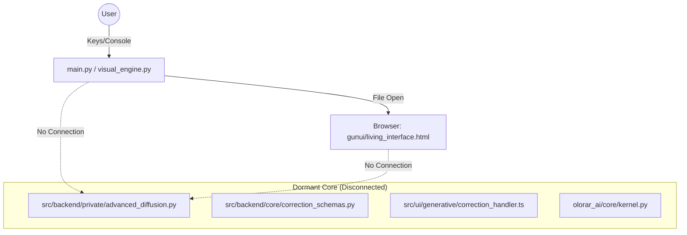

# Aetherium Genesis - Architectural Audit Report

**Date:** October 26, 2023
**Auditor:** Jules (AI Software Engineer)
**Scope:** Full Repository Audit (Backend, Frontend, Infrastructure)

---

## 1. Executive Summary

**Verdict:** **Concept / Early Prototype**

The "Aetherium Genesis" system is currently a fractured collection of isolated components rather than a functioning software product. It exhibits a "Split Personality":

1.  **The Theatrical Shell (`main.py`, `visual_engine.py`):** A functional but purely cosmetic CLI simulation that opens a browser file. It mimics intelligence via `print` statements and has no connection to the actual AI logic.
2.  **The Latent Core (`src/backend`, `src/ui`):** A sophisticated but dormant set of logic for generative image correction (Stable Diffusion + ControlNet). This code is **never executed** by the main application.

The system is **NOT production-ready**. It is a proof-of-concept where the interface and the brain are on two different islands with no bridge between them.

---

## 2. Architecture Overview

### Current Architecture (Fractured)

### Main Architectural Principles
*   **Session-Bound Correction:** Defined in `CorrectionEvent` schemas but not enforced in runtime (since runtime doesn't exist).
*   **Deterministic Generative Logic:** `AdvancedDiffusion` enforces deterministic seeds/logic per request, which is a strong foundation for a "digital being" that doesn't hallucinate randomly.
*   **Silent Governance:** The `olorar_ai` module attempts to implement a "Silent Steering" mechanism to bias results, but it is currently just a standalone Python script.

---

## 3. Data Flow Analysis (Intended vs Actual)

### The Intended "Awakening" Loop
1.  **Input:** User performs a mouse gesture on the Canvas (`living_interface.html`).
2.  **Capture:** `correction_handler.ts` captures the vector, batches "move" events, and creates a `CorrectionEvent`.
3.  **Transport:** *[MISSING]* WebSocket/HTTP sends JSON to Python.
4.  **Processing:** `AdvancedDiffusion.regenerate()` calculates the new pixel state using ControlNet Tile.
5.  **Merge:** `RegionExtractor` blends the new patch into the frame.
6.  **Render:** *[MISSING]* Updated image frame sent back to Canvas.

### The Actual Loop
1.  **Input:** User presses "Enter" 3 times in the CLI (`main.py`).
2.  **Simulation:** `main.py` prints "System Awakened".
3.  **Visual:** `webbrowser.open` launches `living_interface.html`.
4.  **End:** User interacts with particles in the browser, but `console.log` is the only thing listening.

---

## 4. Risk Assessment

### Scalability & Performance
*   **Critical Hardware Dependency:** `AdvancedDiffusion` initializes `ControlNetModel` and `StableDiffusionControlNetPipeline`. This requires ~6-8GB VRAM (CUDA). The current `main.py` has no checks for this, and the fallback to CPU would result in 10-30s latency per frame (unusable for "live" correction).
*   **Startup Time:** Loading SD v1.5 takes 5-10 seconds. If `main.py` were connected, this cold start would break the "Ritual" immersion.
*   **Network Payload:** Sending full Base64 images or even regional patches over standard HTTP for every gesture batch is a bottleneck. A binary WebSocket protocol is required.

### Correctness & Safety
*   **Session Isolation:** The `CorrectionEvent` schema correctly omits user PII, relying on ephemeral `session_id`. This is a strong architectural decision for privacy.
*   **Thread Safety:** `main.py` uses a simple `threading.Thread` for idle monitoring. If the backend is integrated, `StableDiffusion` pipelines are not inherently thread-safe for concurrent requests without a queue.

### Test Coverage
*   **Status:** Mixed.
*   **Strengths:** `tests/test_advanced_diffusion.py` exists and uses mocks (`unittest.mock`), meaning the CI pipeline can run without a GPU.
*   **Weaknesses:** There are no integration tests because there is no integration. No tests cover the frontend JS/TS logic.

---

## 5. Readiness Verdict

**Level 2: Component Prototype**
*   Individual components (Particle UI, Diffusion Class, Schema definitions) exist and likely work in isolation.
*   The "System" as a whole does not exist yet.

---

## 6. Recommendations

### Immediate Actions (Next 3 Steps)

1.  **Build the Bridge (Server):**
    *   **Do this:** Create a lightweight FastAPI server in `src/backend/server.py`.
    *   **Why:** You need a way for the JS frontend to talk to the Python backend.
    *   **Endpoints:** `POST /session/start`, `WS /session/stream`.

2.  **Consolidate Frontend:**
    *   **Do this:** Integrate the logic from `src/ui/generative/correction_handler.ts` directly into `gunui/living_interface.html` (or set up a build step).
    *   **Why:** currently `correction_handler.ts` is just a loose file. The browser cannot execute raw TypeScript.

3.  **Fix Dependencies:**
    *   **Do this:** Update `requirements.txt`.
    *   **Add:** `torch`, `diffusers`, `transformers`, `accelerate`, `fastapi`, `uvicorn`, `python-multipart`.
    *   **Why:** The code will crash immediately upon import without these.

### What NOT to build yet
*   **Mobile Support (Kivy/Buildozer):** The current architecture relies heavily on Web technologies (HTML/Canvas) and heavy Python ML libraries. Packaging this as an Android APK via Buildozer is extremely difficult (embedding PyTorch/CUDA on Android). Focus on a Web/Desktop architecture first.
*   **Voice/Audio Integration:** `main.py` implies voice visualization. Ignore this until the core visual loop works.

### Refactoring Needed
*   **Deprecate `main.py` CLI:** The CLI "knock" ritual should be moved to the Frontend. The Python process should purely be a server (daemon), not an interactive CLI application.
