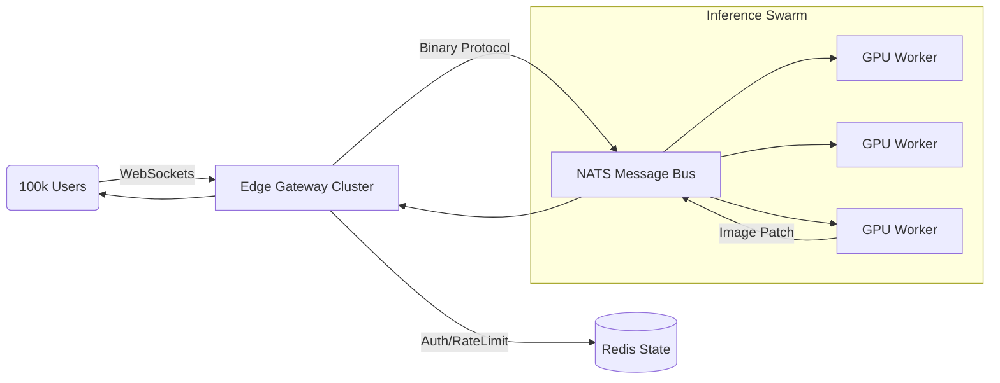

# Aetherium Genesis - Scaling Strategy (100k Users)

**Target:** Support 100,000 concurrent users with real-time generative interaction.
**Context:** The current system is a local prototype. Scaling to this magnitude requires a complete paradigm shift from "Monolithic App" to "Distributed Event-Driven Architecture".

---

## 1. What Will Break First? (The Failure Cascade)

If we attempted to run the current (theoretical) architecture with 100,000 users, the system would fail in the following order, likely within seconds:

1.  **The Connection Layer (Immediate):**
    *   **Issue:** A single server instance cannot maintain 100,000 persistent WebSocket connections. Ephemeral port exhaustion and file descriptor limits (typically ~65k limit) will cause new connections to be rejected immediately.
    *   **Result:** `Connection Refused` for 50%+ of users.

2.  **The Inference Bottleneck (Seconds later):**
    *   **Math:** If 10% of users (10,000) trigger a correction simultaneously.
    *   **Capacity:** A standard Stable Diffusion v1.5 inference takes ~1-2 seconds on a consumer GPU. A highly optimized A100 pipeline (TensorRT) takes ~200ms.
    *   **Throughput:** One A100 can handle ~5 requests/second.
    *   **Load:** 10,000 requests/second.
    *   **Deficit:** You would need **2,000 A100 GPUs** to handle this load in real-time.
    *   **Result:** The inference queue grows infinitely. Latency spikes from 200ms to minutes/hours. The "Real-time" illusion shatters.

3.  **Memory (VRAM/RAM):**
    *   **Issue:** The current code loads the model *inside* the class instance. If you tried to spawn threads/processes for concurrency, you would run out of VRAM (one copy of model per thread) instantly.

---

## 2. Critical Monitoring Metrics

To survive this scale, you must monitor the following metrics with <1s granularity (Prometheus/Grafana):

### Infrastructure
*   **Active Connections:** Number of open WebSockets.
*   **GPU Duty Cycle:** % of time GPU is computing vs. waiting for data (aim for >95%).
*   **VRAM Usage:** strict alerts at 90% capacity.

### Application (The "Pulse")
*   **End-to-End Latency:** Time from `Gesture` (Client) -> `Render` (Client). Target: < 200ms.
*   **Inference Latency:** Time spent strictly in `pipe()`. Target: < 100ms.
*   **Queue Depth:** Number of events waiting for a GPU slot. **This is the leading indicator of death.**
*   **Correction Rejection Rate:** % of events dropped due to "Session Debounce" or "Rate Limiting" (Governance).

---

## 3. Required Redesign (The Evolution Path)

The system must be refactored into three distinct layers.

### Layer A: The Edge (Connection Handling)
*   **Change:** Remove all logic from the WebSocket server.
*   **New Component:** **Edge Gateway Cluster** (Go/Rust/Node).
*   **Role:** Holds 100k TCP connections. Performs auth. Forwards binary payloads to a Message Bus.
*   **Technology:** NATS JetStream or Kafka.

### Layer B: The Brain (Inference Swarm)
*   **Change:** Decouple `AdvancedDiffusion` from the API.
*   **New Component:** **GPU Worker Swarm**.
*   **Role:** Stateless workers that pull batch jobs from NATS.
*   **Optimization:**
    *   **Batching:** Process 8-16 user requests in a single GPU pass (increases throughput significantly).
    *   **Model Server:** Use **NVIDIA Triton Inference Server** instead of raw PyTorch pipes.
    *   **Quantization:** Switch to `int8` quantization or LCM (Latent Consistency Models) to drop inference time to ~50ms.

### Layer C: The Governance (State)
*   **Change:** Move `CorrectionEvent` state out of memory.
*   **New Component:** **Redis Cluster**.
*   **Role:** Store session context (Phi levels, last interaction time).
*   **Governance:** The `OlorarKernel` (Governance) runs as a lightweight sidecar to the Gateway, rejecting "unsafe" intents *before* they hit the expensive GPU queue.

### Architecture Diagram (Target)

---

## 4. Immediate Next Steps for Scaling

1.  **Implement Rate Limiting:** You cannot support 100k users without strict per-user caps (e.g., 1 correction / 5 seconds).
2.  **Containerize:** Dockerize the `AdvancedDiffusion` module to run as a standalone worker.
3.  **Switch to LCM/Turbo:** Replace SD v1.5 with SDXL Turbo or LCM-LoRA to achieve sub-100ms inference.
